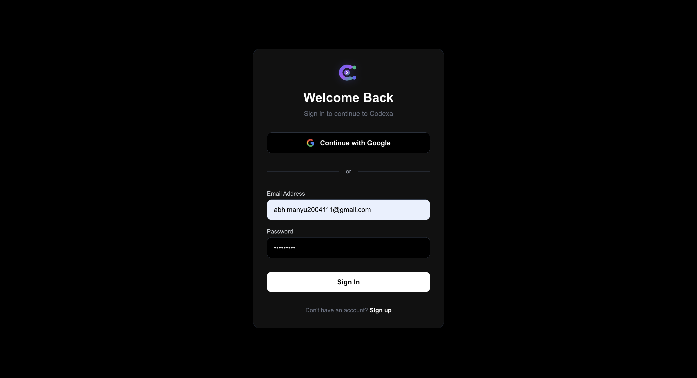
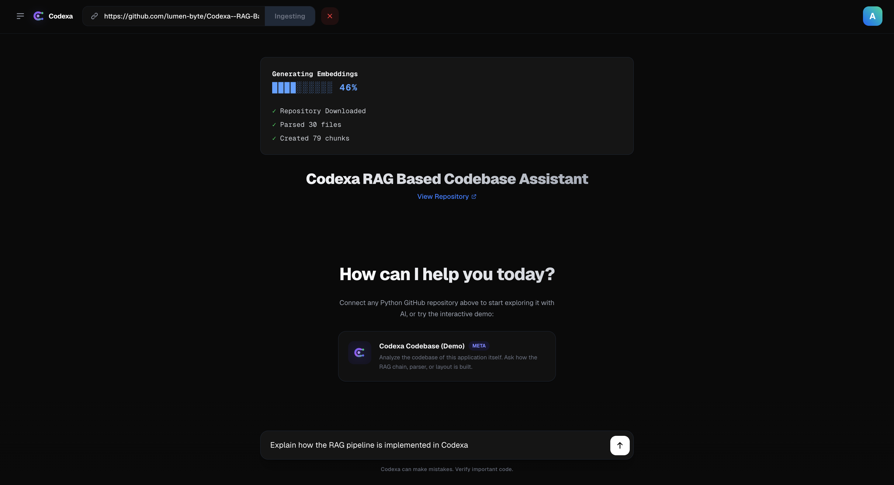
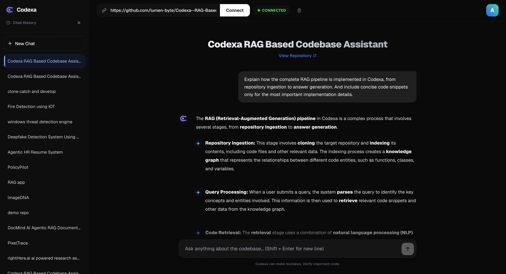
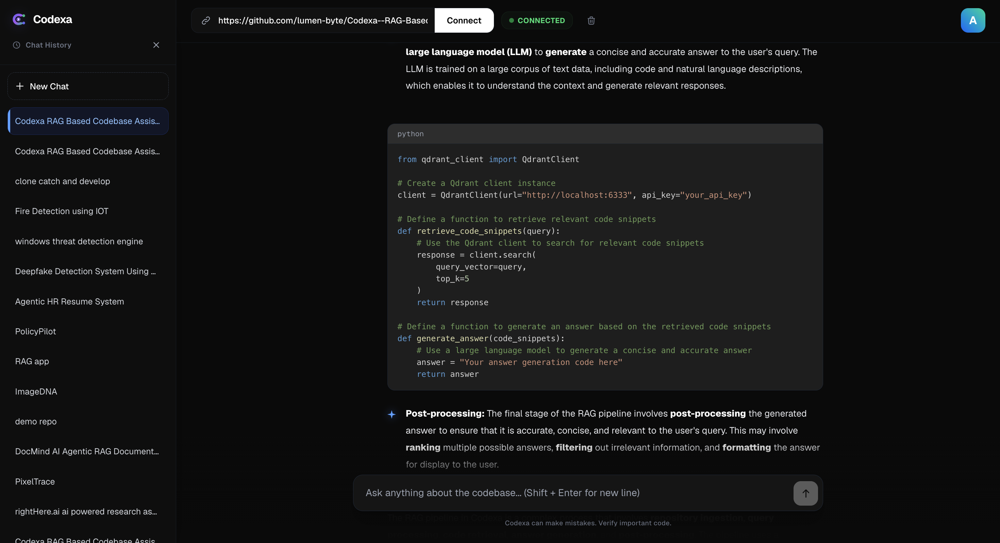
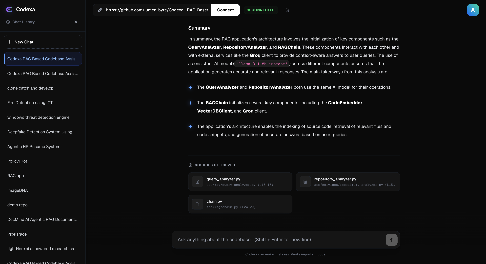

# Codexa
**AI-powered Codebase Analysis Platform**

Codexa enables developers to understand large Python GitHub repositories through retrieval-augmented generation (RAG), providing grounded answers with precise code citations.

---

## Demo


*Secure authentication using OAuth and JWT.*


*Real-time streaming feedback during AST parsing and vector embedding (e.g., 46% complete).*


*Interactive chat with conversational history and repository context.*

 
*Deep architectural explanations including exact code snippets from your repository.*


*Grounded answers featuring traceable source file citations.*

---

## Why Codexa?

Large repositories are notoriously difficult to navigate. Traditional AI assistants often hallucinate because they lack comprehensive repository context, leading to inaccurate architectural advice. Codexa solves this by downloading, parsing, and semantically indexing the entire repository, ensuring that every AI answer is strictly grounded in retrieved code.

---

## Features

* **GitHub Repository Ingestion:** Seamlessly download and process remote repositories.
* **Tree-sitter Parsing:** Advanced syntax-aware chunking for Python.
* **Semantic Code Search:** Fast vector similarity search across thousands of files.
* **AI-Powered Explanations:** Deep contextual understanding of project architecture.
* **Source Citations:** Every claim is backed by direct references to your source files.
* **Authentication:** Secure OAuth and JWT-based session management.
* **Conversation History:** Persistent chat sessions organized by repository context.

---

## Architecture

```text
GitHub Repository
       ↓
  ZIP Download (In-memory)
       ↓
  Tree-sitter (AST Parsing)
       ↓
  Semantic Chunking (Classes/Functions)
       ↓
  Gemini Embeddings (Batched)
       ↓
  Qdrant Vector Database
       ↓
  Similarity Search / Retriever
       ↓
  Groq LLM (Llama 3)
       ↓
  Grounded Answer + Citations
```

---

## Tech Stack

| Component | Technology |
| :--- | :--- |
| **Frontend** | Next.js 14, React, Tailwind CSS, TypeScript |
| **Backend** | FastAPI, Python, Uvicorn |
| **Database** | PostgreSQL (Relational), Qdrant (Vector) |
| **AI / ML** | Groq (Inference), Gemini (Embeddings), LangChain |
| **Parsing** | Tree-sitter (AST) |
| **Auth** | NextAuth |

---

## How it Works

1. **Ingestion:** A user inputs a GitHub repository URL. The backend downloads the repository as a ZIP archive in memory, bypassing massive recursive network calls.
2. **Parsing & Chunking:** The codebase is traversed and parsed using Tree-sitter. Code is intelligently chunked at the semantic level (functions, classes) rather than arbitrary character limits.
3. **Embedding:** Chunks are batched and sent to Google Gemini to generate dense vector embeddings.
4. **Storage:** Vectors and their associated metadata (file paths, line numbers) are stored in Qdrant.
5. **Retrieval & Generation:** When a user asks a question, the query is embedded, semantically matched against the vector database, and the most relevant code chunks are injected into a Groq-hosted LLM prompt to generate a highly accurate, cited response.

---

## Performance Optimizations

**Embedding Optimization**
Initially, embeddings were generated one chunk at a time. This quickly hit Gemini's request-per-minute rate limits and significantly increased ingestion latency for large codebases. The pipeline was redesigned to use batched embedding requests, drastically reducing API calls and improving ingestion speed while staying safely within rate limits.

**Repository Download**
The first implementation recursively fetched every individual file using the GitHub API, resulting in hundreds of HTTP requests and severe rate-limiting. The current version downloads the repository as a single ZIP archive into memory, significantly reducing network overhead and improving the reliability of the ingestion phase.

**Streaming API Error Handling**
Because the Groq LLM streams its response using server-sent events (SSE) in an ASGI loop, standard middleware cannot catch exceptions (such as sudden quota limits) that occur during the stream. We implemented graceful generator-level error trapping to intercept rate-limit failures and yield clean, user-friendly natural language errors directly into the chat UI instead of abruptly closing the network connection.

---

## Design Decisions

### Why Tree-sitter?
Tree-sitter enables syntax-aware chunking by splitting code logically at functions and classes instead of arbitrary character limits. This preserves the semantic meaning and structural integrity of the code during retrieval.

### Inference Engine (Groq)
The initial prototype used local inference through Ollama. The production version migrated to Groq to improve latency, simplify deployment, and provide a more consistent user experience. Groq provides significantly lower inference latency than local models while maintaining strong response quality, making it vastly superior for an interactive production application.

### Why Gemini Embeddings?
Gemini Embeddings provided exceptional semantic search performance and a massive context window while remaining highly cost-effective and scalable for our repository scale.

### Current Scope (Python Only)
Codexa currently focuses exclusively on Python repositories. Restricting the parser to a single language allowed us to build deeper syntax-aware chunking, achieve higher retrieval accuracy, and provide a more reliable developer experience. The architecture is intentionally decoupled and designed to easily support additional languages in future releases.

---

## Challenges Overcome

* **API Rate Limits:** Balancing high-throughput chunk embedding with strict third-party API quotas.
* **CORS & Deployment Environments:** Managing complex preflight CORS headers across multi-environment deployments (Vercel Frontend to Render Backend).
* **State Management:** Maintaining real-time streaming UI states across complex asynchronous backend workflows.

---

## Future Improvements

* **Multi-language Support:** Expanding the Tree-sitter implementation to support TypeScript, Go, and Rust.
* **Hybrid Retrieval:** Combining dense vector search with BM25 keyword search for better exact-match variable lookups.
* **Repository Diff Analysis:** Allowing the assistant to understand active Pull Requests and recent commits.
* **Incremental Indexing:** Only re-embedding files that have changed since the last ingestion.
* **Agentic Workflows:** Enabling the assistant to actively execute code or write PRs based on conversational context.
